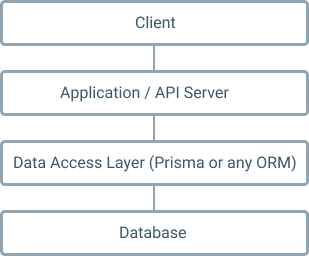

👉 ####`Cursors in a line`

1. Go to end of line -> `Command` + `Left/Right` (↔️)

2. Go to next word ( move cursor word by word) -> `Alt` + `Left/Right` (↔️)

3. Selecting whole line (it works wherever your cursor is in that line)`Command` + `Shift` + `K`

4. Selecting word by word -> `Alt` + `Shift` + `Left/Right` (↔️)

👉 #### `Duplicate a line`

5. Duplicate a line above/below -> `Alt` + `Shift` + `Up/Down` (↕️)

👉 #### `Move a line`

6. Move a line in places of above lines and below ones -> `Option/Alt` + `Up/Down` (↕️)

👉 #### `Selecting multiple similar words at the same time`


As is shown, `data access layer` is where `prisma` stays and according to your `prisma datamodel` it creates tables and generates CRUD API for the same datamodel and gives it to `API server` to query or store data.

### Main concepts and definitions

Prisma has three main concepts: `datamodel`, `prisma client`, `prisma server`.

##### Datamodel

I understand prisma datamodel as tables, like if you have `user` datamodel then you have `user` table and it has table rows such as

- `id`
- `name`
- `email`
- `role`

The datamodel uses Graphql SDL Syntax with `.prisma` extension.
Let's create a prisma datamodel to clear these concepts:

```graphql
type User {
  id: ID! @id
  name: String
  email: String! @unique
  role: Role! @default(value: USER)
}
```

We will stop by the syntax definitions later. So right now, I have `User` type or table with 4 scalar fields or table rows `id`, `name`, `email`, `role`.

Git is a difficult subject to tackle for self-taught web developers who didn't learn to code with a team. If you've always worked alone and want an explanation of how to get started with Git, this tutorial is for you.

> I'm an egotistical bastard, and I name all my projects after myself. First Linux, now Git.
> <cite>- Linus Torvalds, author of Git</cite>

#### Prerequisites

"Everything is an object in JavaScript", probably you have heard that many times. There are exceptions like `null` and `undefined` operators are not an object.
